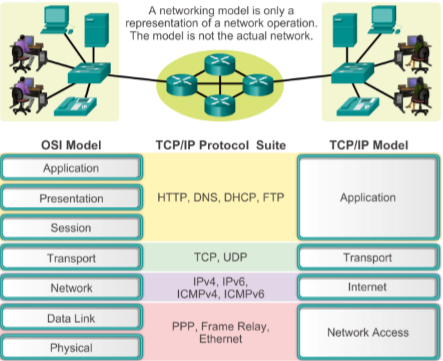
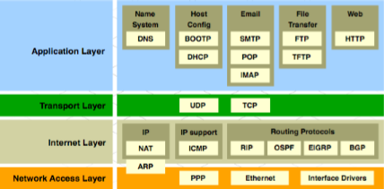
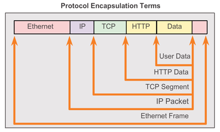
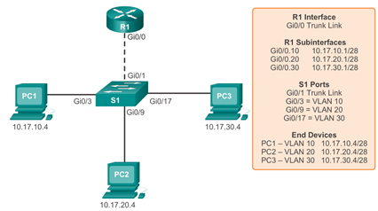
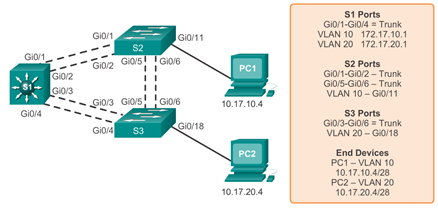
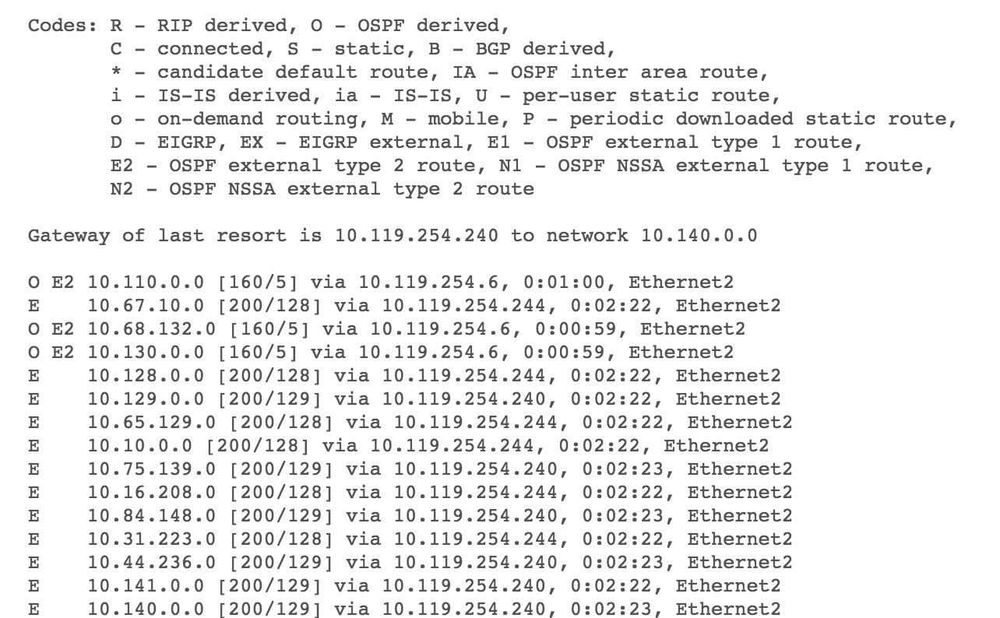

#Computernetwerken 2
[**Terug naar samenvattingen**](./README.md)

**Overzicht van de hoofdstukken:**  

1. [Theorie](#theorie)  
 1. [Hoofdstuk 1](#hoofdstuk-1)  
 2. [Hoofdstuk 2](#hoofdstuk-2)  
 3. [Hoofdstuk 3](#hoofdstuk-3)  
 4. [Hoofdstuk 4](#hoofdstuk-4)  
 5. [Hoofdstuk 5](#hoofdstuk-5)  
 6. [Hoofdstuk 6](#hoofdstuk-6)
2. [Afkortingen](#afkortingen)  
3. [Commandos](#commandos)  
4. [VLSM](#vlsm-voorbeeld)

**Zaken zeker naar te kijken:**  
subnetting, switching technieken, ipv6, bootproces, dhcp en routing technieken & protocollen.

##Theorie
###Hoofdstuk 1
[Terug naar hoofdstukken overzicht](#computernetwerken-2)

**DHCP handshake:**  
DORA -> Discover, Offer, Request, Acknowledge

**Store-and-forward switching** *(hoogstwaarschijnlijk examen vraag)*:  
Krijgt het volledige frame en voert een CRC check uit. Als de CRC check in orde is zoekt de switch naar het destination address en stuurt de frame uit de benodigde poort. Is nodig voor Quality of Service (QoS) analyse van geconvergeerde netwerken waar frame classificatie voor de prioriteit van het verkeer  nodig is.

**Cut-through** *(hoogstwaarschijnlijk examen vraag)*:  
Verstuurt de volledige frame voordat deze volledig ontvangen is. Enkel het destination address wordt gelezen.

**Gelaagd model (APSTNDP)** *(hoogstwaarschijnlijk examen vraag)*:  

  

**TCP/IP Protocol Suite en communicatie** *(hoogstwaarschijnlijk examen vraag)*:   

  

**Encapsulation** *(hoogstwaarschijnlijk examen vraag)*:  

  
  

**Converged Network:**  
VoIP, video support, video conferencing, call control, voice messaging, etc. Multiple types of traffic only one network to manage.

**Borderless switched network:**  
 A network architecture that allows organizations to connect anyone, anywhere, anytime, and on any device securely, reliably, and seamlessly.
 
**Access, Distribution and Core layers:**  
*Access Layer:*  
The access layer represents the network edge, where traffic enters or exits the campus network. Traditionally, the primary function of an access layer switch is to provide network access to the user.

*Distribution Layer:*  

1. Providing intelligent switching, routing, and network access policy functions to access the rest of the network
2. Providing high availability through redundant distribution layer switches to the end-user and equal cost paths to the core
3. Providing differentiated services to various classes of service applications at the edge of the network 

*Core Layer:*  
The core layer is the network backbone. It connects several layers of the campus network. The core layer serves as the aggregator for all of the other campus blocks and ties the campus together with the rest of the network. The primary purpose of the core layer is to provide fault isolation and highspeed backbone connectivity. 
 
**Steps of building the MAC address table to forward frames:**
 
1. The switch receives a frame from PC 1 on Port 1. 
2. The switch examines the source MAC address and compares it to MAC address table. If the address is not in the MAC address table, it associates the source MAC address of PC 1 with the ingress port (Port 1) in the MAC address table. If the MAC address table already has an entry for that source address, it resets the aging timer. An entry for a MAC address is typically kept for five minutes. 
3. After the switch has recorded the source address information, the switch examines the destination MAC address. If the destination address is not in the MAC table or if it’s a broadcast MAC address, as indicated by all Fs, the switch floods the frame to all ports, except the ingress port. 
4. The destination device replies to the frame with a unicast frame addressed to PC 1. 
5. The switch enters the source MAC address of PC 3 and the port number of the ingress port into the address table. The destination address of the frame and its associated egress port is found in the MAC address table . 
6. The switch can now forward frames between these source and destination devices without flooding, because it has entries in the address table that identify the associated ports .

**Alleviating network congestion** *(hoogstwaarschijnlijk examen vraag)*:  

1. Facilitating the segmentation of a LAN into separate collision domains
2. Providing full-duplex communication between devices
3. Taking advantage of their high-port density
4. Buffering large frames
5. Employing high-speed ports
5. Taking advantage of their fast internal switching process
6. Having a low, per-port cost

###Hoofdstuk 2
[Terug naar hoofdstukken overzicht](#computernetwerken-2)

**Boot sequence switch** *(hoogstwaarschijnlijk examen vraag)*:  

1. Power-on self test (POST) -> CPU, DRAM, flash 
2. Run boot loader software. 
3. Boot loader performs low-level CPU initialization. 
4. Boot loader initializes the flash file system 
5. Boot loader locates and loads a default IOS operating system software image into memory and passes control of the switch over to the IOS.
6. Attempts to automatically boot by using information in the BOOT environment variable. 
7. If this variable is not set, the switch performs a top-to-bottom search through the flash file system. It loads and executes the first executable file, if it can. 
8. The IOS software then initializes the interfaces using the Cisco IOS commands found in the configuration file and startup configuration, which is stored in NVRAM. 

**Recovering from a system crash:**  

1. Connect a PC by console cable to the switch console port. Configure terminal emulation software to connect to the switch. 
2. Unplug the switch power cord. 
3. Reconnect the power cord to the switch and, within 15 seconds, press and hold down the Mode button while the System LED is still flashing green. 
4. Continue pressing the Mode button until the System LED turns briefly amber and then solid green; then release the Mode button. 
5. The boot loader switch: prompt appears in the terminal emulation software on the PC. 
The boot loader command line supports commands to format the flash file system, reinstall the operating system software, and recover from a lost or forgotten password. For example, the dir command can be used to view a list of files within a specified directory as shown in the figure. 

**SSH Operation:**  

1. Secure Shell (SSH) is a protocol that provides a secure (encrypted), command-line based connection to a remote device. 
2. SSH is commonly used in UNIX-based systems. 
3. The Cisco IOS software also supports SSH. 
4. A version of the IOS software, including cryptographic (encrypted) features and capabilities, is required to enable SSH on Catalyst 2960 switches. 
5. Because its strong encryption features, SSH should replace Telnet for management connections. 
6. SSH uses TCP port 22, by default. Telnet uses TCP port 23.

**MAC address flooding** *(hoogstwaarschijnlijk examen vraag)*:  
An attacker could exploit this behavior to gain access to traffic normally controlled by the switch by using a PC to run a MAC flooding tool. Such tool is a program created to generate and send out frames with bogus source MAC addresses to the switch port. 

**DHCP spoofing** *(hoogstwaarschijnlijk examen vraag)*:  
A fake DHCP server is placed in the network to issue dhcp addresses to clients.

**DHCP starvation** *(hoogstwaarschijnlijk examen vraag)*:  
Is often used before a DHCP spoofing attack to deny service to the legitimate DHCP server.

**DHCP snooping:**  
Specifies which switch ports van respond to DHCP requests. Example:
```
ip dhcp snooping  
ip dhcp snooping vlan 10,20  
interface fa0/1  
ip dhcp snoopîng trust  
interface fa0/2  
ip dhcp limit rate 5
```

**NTP network time protocol:**  
Is used to synchronize the clock of computer systems data networks. It can get the correct time from an internal or external time source.

###Hoofdstuk 3
[Terug naar hoofdstukken overzicht](#computernetwerken-2)

**VLAN's:**  

1. A vlan is a logical partition of a layer 2 network.
2. Each vlan is a broadcast domain, usually with its own IP network.
3. VLANs are mutually isolated and packets can only pass between them via a router.
4. Usually the partitioning of a layer 2 network takes place in a switch.
5. Are based on logical connections.

**Benefits of vlan:**  
Security, cost reduction, better performance, shrink broadcast domains, improved IT staff efficiency, simpler project and application management.

**Frame tagging:**  
Process of adding a VLAN identification header to the frame.

**VLAN range** *(hoogstwaarschijnlijk examen vraag)*:  
Normale range: 1-1005 / stored in vlan.dat  
Extended range: 1006 - 4096 / stored in NVRAM

**Removing a VLAN:**  
Before deleting a VLAN, be sure to first reassign all member ports to a different VLAN.

###Hoofdstuk 4
[Terug naar hoofdstukken overzicht](#computernetwerken-2)

**Routing:**  

1. Routers use static routes and dynamic routing protocols to learn about remote networks and build their routing tables.
2. Routers use routing tables to determine the best path to send packets.
3. Routers encaptulate the packet and forwards it to the interface indicated in the routing table.

**Packet forwarding methods:**

1. Process switching -> an older packet forwarding mechanism still available for Cisco routers.
2. Fast switching -> a common packet forwarding mechanism which uses a fast-switching cache to store next hop information.
3. Cisco express forwarding -> the most recent, fastest and preferred cisco ios packet-forwarding mechanism. Table entries are not packet-triggered like fast switching but change-triggered

**Process switching:**  
When a packet arrives on an interface, it is forwarded to the control plane where the CPU matches the destination address with an entry in its routing table, and then determines the exit interface and forwards the packet. It is important to understand that the router does this for every packet, even if the destination is the same for a stream of packets.

**Fast switching:**  
When a packet arrives on an interface, it is forwarded to the control plane where the CPU searches for a match in the fastswitching cache. If it is not there, it is process-switched and forwarded to the exit interface. The flow information for the packet is also stored in the fastswitching cache. If another packet going to the same destination arrives on an interface, the next-hop information in the cache is reused without CPU intervention. 

**Cisco express forwarding:**  
Builds a Forwarding Information Base (FIB), and an adjacency table. When a network has converged, the FIB and adjacency tables contain all the information a router would have to consider when forwarding a packet. The FIB contains precomputed reverse lookups, next hop information for routes including the interface and Layer 2 information. Cisco Express Forwarding is the fastest forwarding mechanism and the preferred choice on Cisco routers.

**IPV6** *(hoogstwaarschijnlijk examen vraag)*:  
link-local: 2001:0DB8:ACAD:0001:/64  
multicast: FF00::/8  
link-local unicast: FE80::/10  
site local unicast: FEC0::/10  

###Hoofdstuk 5
[Terug naar hoofdstukken overzicht](#computernetwerken-2)

**Inter-VLAN routing:**  
Layer 2 switches cannot forward traffic between VLANs without the assistance of a router. Inter-VLAN routing is a process for forwarding network traffic from one VLAN to another, using a router.

**Router on a stick** *(hoogstwaarschijnlijk examen vraag)*:  
A type of router configuration in which a single physical interface routes traffic between multiple VLANs on a network.



Router:  
```
interface g0/0.10
encapsulation dot1q 10
ip address 10.17.10.1 255.255.255.240
end
```
Switch:  
```
interface g0/3
switchport mode trunk
switchport trunk allowed vlan 10
```

**Multilayer switches** *(hoogstwaarschijnlijk examen vraag)*:   
Multilayer switches can perform Layer 2 and Layer 3 functions, replacing the need for dedicated routers. They support dynamic routing and inter-VLAN routing.



###Hoofdstuk 6
[Terug naar hoofdstukken overzicht](#computernetwerken-2)

**Voordelen van static routing** *(hoogstwaarschijnlijk examen vraag)*:  

2. Static routes are not advertised over the network, resulting in better security.
3. Static routes use less bandwidth than dynamic routing protocols, no CPU cycles are used to calculate and communicate routes.
4. The path a static route uses to send data is known.

**Nadelen van static routing** *(hoogstwaarschijnlijk examen vraag)*:  

1. Initial configuration and maintenance is time-consuming. 
2. Configuration is error-prone, especially in large networks. 
3. Administrator intervention is required to maintain changing route information. 
4. Does not scale well with growing networks; maintenance becomes cumbersome. 
5. Requires complete knowledge of the whole network for proper implementation

**Wanneer static routes gebruiken**  *(hoogstwaarschijnlijk examen vraag)*:  

1. Providing ease of routing table maintenance in smaller networks that are not expected to grow significantly.
2. Routing to and from stub networks. A stub network is a network accessed by a single route, and the router has no other neighbors.
3. Using a single default route to represent a path to any network that does not have a more specific match with another route in the routing table. Default routes are used to send traffic to any destination beyond the next upstream router.

**Often uses of static routing:**  

1. Connect to a specific network. 
2. Provide a Gateway of Last Resort for a stub network. 
3. Reduce the number of routes advertised by summarizing several contiguous networks as one static route. 
4. Create a backup route in case a primary route link fails

**Default static route** *(hoogstwaarschijnlijk examen vraag)*:  
is a route that matches all packets. A default static route is simply a static route with 0.0.0.0/0 as the destination ipv4 address.

**Floating static route:**  

 1. Floating static routes are static routes that are used to provide a backup path to a primary static or dynamic route, in the event of a link failure. 
 2. The floating static route is only used when the primary route is not available. 
 3. To accomplish this, the floating static route is configured with a higher administrative distance than the primary route. 

**Show IP route output example** *(hoogstwaarschijnlijk eaxamen vraag)*:  
  

In volgorde vinden we:  

1. Type route
2. Netwerk (subnet) van de route die ingesteld staat
3. [Administrative Distance / Metric]
4. IP van de next hop router poort
5. Tijd dat de route bestaat
6. Poort waaruit gestuurd wordt

[Zie hier voor een iets gedetailleerdere analyse](https://keepingitclassless.net/2011/07/the-anatomy-of-show-ip-route/)

##Afkortingen
[Terug naar hoofdstukken overzicht](#computernetwerken-2)

Alle afkortingen: [**Credit to Lisa Dossche**](https://lookaside.fbsbx.com/file/Afkortingen%20Netwerken%202.pdf?token=AWxoObw3ioW3CR525437Ols0U50zqyOz7E_ACN3VchI3TV42KWF_Spi8SPISfqzFPOKKn3rB_uJbCmbAKMXyCbHBP6vOGhak1ncdNvxqKaPl_d_N6V1lse69euTTNpmzH5yNQhZdACCFCXQg_1DBcgC8hQjva1r5xowe2RFRhj5GxQ)

####*(misschien examen vraag?)* Belangrijkste afkortingen
| Afkorting | Betekenis |
| :---: | --- |
| CAM | Content addressable memory |
| CRC | Cyclic redundancy check |
| FCS | Frame-check-sequence |
| POST | Power-on self-test |
| SSH | Secure shell |
| DoS | Denial-of-Service |
| DNS | Domain Name Server |
| NTP | Network time protocol |
| VLAN | Virtual local area network |
| DTP | Dynamic trunking protocol |
| CPU | Central processing unit |
| RAM | Random access memory |
| ROM | Read-only memory |
| OSPF | Open shortest path first |
| EIGRP | Enhanced interior gateway routing protocol |
| CIDR | Classless inter-domain routing |
| VLSM | Variable-length subnet masking |
| FLSM | Fixed-length subnet masking |
| IMAP | Internet message access protocol |
| SMTP | Simple mail transfer protocol |

##Commandos
[Terug naar hoofdstukken overzicht](#computernetwerken-2)

###Initiële configuratie van switch / router
| Omschrijving | Commando |
| --- | --- |
|	Set hostname	|	hostname Router	|
|	Set a motd banner	|	banner motd #	|
|	Remove the motd	|	no motd	|
|	Enter basic configuration mode	|	enable	|
|	Enter global configuration mode	|	conf t	|
| Set secret | enable secret class |
| Configure an enable password | enable password cisco |
| Set a password for telnet lines | password cisco |
| Specify the lines | line vty 0 15 |
| Set ssh | transport input ssh |
| Set ssh | login local |
| Enable password encryption | service password-encryption |

##Basis configuratie commando's
| Omschrijving | Commando |
| --- | --- |
|	Enter interface configuration mode for SVI	|	interface vlan99	|
|	Configure the management interface IP	|	ip addr 172.17.99.1	|
|	Configure default gateway |	ip default-gateway 172.17.99.1 |
|	Enable the management interface	|	no sh |
|	Return to the priviliged EXEC mode	|	end	|
|	Save the running config to the startup	|	copy running-config startup-config	|
|	Show the current running configuration 	|	show running-config	|
|	Show the basic interface configuration	|	show ip interface brief	|
| 	Configure the interface duplex	|	duplex full	|
|	Configuyre the interface speed 	|	speed 100	|
|	Enable auto-MDIX	|	mdix auto |
| 	Display the MAC address table 	|	show mac-address-table	|

###SSH
| Omschrijving | Commando |
| --- | --- |
|	Set domain name	|	ip domain-name cisco.com	|
|	Generate rsa key	|	crypto key generate rsa	|
|	Set login info	|	username admin password ccna	|
|	Determine the line	|	line vty 0 15	|
|	Set SSH to the line	|	transport input ssh	|
|	Configure the login type	|	login local	|
|	End the configuration	|	end 	|

###Dynamic Port Security
| Omschrijving | Commando |
| --- | --- |
|	Specify the interface to be configured for port security	|	interface f0/18	|
|	Set the interface mode to access	|	switchport mode access	|
|	Enable port security on the interface	|	switchport port-security	|

###Network Time Protocol
| Omschrijving | Commando |
| --- | --- |
|	Enable NTP on client	|	ntp master 1	|
|	Set the ntp master server IP	|	ntp server 10.1.1.1	|
|	Show all of the NTP associations	|	show ntp associations	|

###VLAN
| Omschrijving | Commando |
| --- | --- |
|	Enter global configuration mode	|	conf t	|
|	Create a VLAN on the machine	|	vlan 20	|
|	Set the name	|	name student	|
|	Set an interface to access mode	|	switchport mode access	|
|	Give the interface access to a specific VLAN	|	switchport access vlan 20	|
|	End the configuration	|	end	|
|	Unassign an interface of the VLAN and set it back to native |	no switchport access vlan |
|	Show the VLAN overview	|	show vlan brief	|

###Trunk
| Omschrijving | Commando |
| --- | --- |
|	Enter global configuration mode	|	configure terminal	|
|	Enter interface configuration mode	|	interface f0/1	|
|	Force the link to be a trunk link	|	switchport mode trunk	|
|	Specify a native VLAN for untagged 802.1Q trunks	|	switchport trunk native vlan 99	|
|	Specify the list of VLANs to be allowed on the trunk link	|	switchport trunk allowed vlan 10,20,30,99	|
| Specify a subinterface | interface f0/1.10 |
| Specify a subinterface's VLAN | encapsulation dot1q 10 |
|	Return to the privileged EXEC mode	|	end	|

###Routing
| Omschrijving | Commando |
| --- | --- |
| Show the current routes | show ip route |
| Set a static route | ip route 'target ip' 'target subnetmask' 'port it goes through' |

`ip route 172.16.0.0 255.248.0.0 s0/0/0`

##VLSM Voorbeeld
[Terug naar hoofdstukken overzicht](#computernetwerken-2)

###Opgave
Een onderneming wenst een hiërarchische IP adressering te implementeren.   
Gegeven is het aantal hosts per departement (LAN) en enkele seriële verbindingen. Gebruik VLSM om het netwerk efficiënt onder te verdelen in hiërarchische subnetten. Het nulde subnet is hier bruikbaar!  

Starting IP: 172.16.0.0
 
Departement Administratie: 20 hosts  
Departement Directie: 10 hosts  
Departement Personeel: 500 hosts  
2 seriële verbindingen  

###Tabel
| Nr   | Naam Subnet   | Netwerkadres & Subnetmask | CIDR | Adresrange | Broadcast | hosts|
| ------------ | -------  | ------  |------|--------    |-------    |--------- |
| 0 	 | Pers  | 172.16.0.0 & 255.255.254.0  | 32-9=/23 | 172.16.0.1 - 172.16.1.254    | 172.16.1.255    | 510 |
| 1 	 | Adm  | 172.16.2.0 & 255.255.255.224  | 32-5=/27 | 172.16.2.1 - 172.16.2.30    | 172.16.2.31    | 30 |
| 2 	 | Dir  | 172.16.2.32 & 255.255.255.240  | 32-4=/28 | 172.16.2.33 - 172.16.2.46    | 172.16.2.47    | 14 |
| 3 	 | Seri1  | 172.16.2.48 & 255.255.255.252  | 32-2=/30 | 172.16.2.49 - 172.16.2.50    | 172.16.2.51    | 2 |
| 4 	 | Seri2  | 172.16.2.52 & 255.255.255.252  | 32-2=/30 | 172.16.2.53 - 172.16.2.54    | 172.16.2.55   | 2 |

###Werkwijze
####Personeel voorbeeld
1. hosts: Minimaal 500 hosts -> 2^8? = 256 Niet genoeg -> 2^9 = **512 hosts (waarvan 2 voor netwerk- en broadcastadres: 510)** 
2. CIDR: 32b – het aantal bits  genomen voor de hosts te bepalen. 
In het geval van personeel is dit 9. ->  **32-9 = 23 -> /23**
3. Subnetmask: Opsplitsen volgens CIDR -> 23b & 9b -> 11111111.11111111.11111110.00000000 -> 
**255.255.254.0**
4. Netwerkadres: Broadcast van vorige subnet + 1. In dit geval starten we vanaf het begin.  
**172.16.0.0**
5. Broadcast bepalen:
**172.16.0.0 -> 172.16.0.255 (0 naar 255 = 256) -> 172.16.1.255**
6. Range: 
 1. Eerste adres is het subnet adres +1: **172.16.0.1**
 2. Laatste adres is het broadcast adres -1: **172.16.1.254**

####Administratie voorbeeld
1. hosts: Minimaal 20 hosts -> 2^5 = **32 hosts (waarvan 2 voor netwerk- en broadcastadres: 30)**
2. CIDR: 32b – het aantal bits  genomen voor de hosts te bepalen. 
In het geval van personeel is dit 9. ->  **32-5 = 27 -> /27**
3. Subnetmask: Opsplitsen volgens CIDR -> 27b & 5b -> 11111111.11111111.11111111.11100000 -> 
**255.255.255.224**
4. Netwerkadres: Broadcast van vorige subnet + 1.
**172.16.2.0**
5. Broadcast bepalen: (netwerkadres + hosts uit puntje 1)
**172.16.2.0 -> 172.16.2.31**
6. Range: 
 1. Eerste adres is het subnet adres +1: **172.16.2.1**
 2. Laatste adres is het broadcast adres -1: **172.16.2.30**

####Directie voorbeeld
1. hosts: 10 hosts nodig, dus 2^4 = **16 hosts (waarvan 2 voor netwerk- en broadcastadres: 14)**
2. CIDR:  **32 - 4 -> /28**
3. Subnetmask: **255.255.255.240**
4. Netwerkadres:  **172.16.2.32**
5. Broadcast bepalen:  **172.16.2.47**
6. Range: 
 1. Eerste adres: **172.16.2.33**
 2. Laatste adres: **172.16.2.46**
