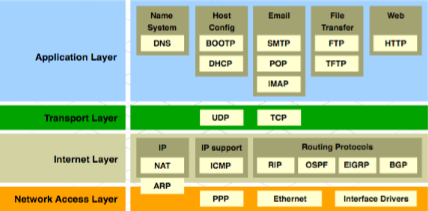
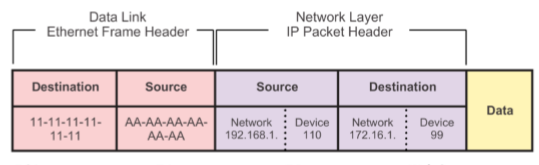

#Samenvatting Computernetwerken 2
[Terug naar overzicht](./README.md)

[Hoofdstuk 1](#Hoofdstuk-1)  
[Hoofdstuk 2](###Hoofdstuk 2)  
[Hoofdstuk 3](###Hoofdstuk 3)  
[Hoofdstuk 4](###Hoofdstuk 4)  
[Hoofdstuk 5](###Hoofdstuk 5)  
[Hoofdstuk 6](###Hoofdstuk 6)

##Theorie
###Hoofdstuk 1
**(ARP) Store-and-forward switching**:  
Krijgt het volledige frame en voert een CRC check uit. Als de CRC check in orde is zoekt de switch naar het destination address en stuurt de frame uit de benodigde poort. Is nodig voor Quality of Service (QoS) analyse van geconvergeerde netwerken waar frame classificatie voor de prioriteit van het verkeer  nodig is.

**(ARP) Cut-through**:  
Verstuurt de volledige frame voordat deze volledig ontvangen is. Enkel het destination address wordt gelezen.

**Gelaagd model**:  

  

**TCP/IP Protocol Suite en communicatie**:   

  

**Encapsulation:**  

  

**Converged Network:**  
VoIP, video support, video conferencing, call control, voice messaging, etc. Multiple types of traffic only one network to manage.

**Borderless switched network:**  
 A network architecture that allows organizations to connect anyone, anywhere, anytime, and on any device securely, reliably, and seamlessly.
 
 **Steps of building the MAC address table to forward frames:**
 
 1. The switch receives a frame from PC 1 on Port 1. 
 2. The switch examines the source MAC address and compares it to MAC address table. If the address is not in the MAC address table, it associates the source MAC address of PC 1 with the ingress port (Port 1) in the MAC address table. If the MAC address table already has an entry for that source address, it resets the aging timer. An entry for a MAC address is typically kept for five minutes. 
 3. After the switch has recorded the source address information, the switch examines the destination MAC address. If the destination address is not in the MAC table or if it’s a broadcast MAC address, as indicated by all Fs, the switch floods the frame to all ports, except the ingress port. 
 4. The destination device replies to the frame with a unicast frame addressed to PC 1. 
 5. The switch enters the source MAC address of PC 3 and the port number of the ingress port into the address table. The destination address of the frame and its associated egress port is found in the MAC address table . 
 6. The switch can now forward frames between these source and destination devices without flooding, because it has entries in the address table that identify the associated ports .

**Alleviating network congestion:**  

1. Facilitating the segmentation of a LAN into separate collision domains
2. Providing full-duplex communication between devices
3. Taking advantage of their high-port density
4. Buffering large frames
5. Employing high-speed ports
5. Taking advantage of their fast internal switching process
6. Having a low, per-port cost

###Hoofdstuk 2
**Boot sequence switch:**

1. Power-on self test (POST) -> CPU, DRAM, flash 
2. Run boot loader software. 
3. Boot loader performs low-level CPU initialization. 
4. Boot loader initializes the flash file system 
5. Boot loader locates and loads a default IOS operating system software image into memory and passes control of the switch over to the IOS.
6. Attempts to automatically boot by using information in the BOOT environment variable. 
7. If this variable is not set, the switch performs a top-to-bottom search through the flash file system. It loads and executes the first executable file, if it can. 
8. The IOS software then initializes the interfaces using the Cisco IOS commands found in the configuration file and startup configuration, which is stored in NVRAM. 

**SSH Operation:**  

1. Secure Shell (SSH) is a protocol that provides a secure (encrypted), command-line based connection to a remote device. 
2. SSH is commonly used in UNIX-based systems. 
3. The Cisco IOS software also supports SSH. 
4. A version of the IOS software, including cryptographic (encrypted) features and capabilities, is required to enable SSH on Catalyst 2960 switches. 
5. Because its strong encryption features, SSH should replace Telnet for management connections. 
6. SSH uses TCP port 22, by default. Telnet uses TCP port 23.

**DHCP spoofing:**  
A fake DHCP server is placed in the network to issue dhcp addresses to clients.

**DHCP starvation:**  
Is often used before a DHCP spoofing attack to deny service to the legitimate DHCP server.

**DHCP snooping:**  
Specifies which switch ports van respond to DHCP requests. Example:
```
ip dhcp snooping  
ip dhcp snooping vlan 10,20  
interface fa0/1  
ip dhcp snoopîng trust  
interface fa0/2  
ip dhcp limit rate 5
```

**NTP network time protocol:**  
Is used to synchronize the clock of computer systems data networks. It can get the correct time from an internal or external time source.

###Hoofdstuk 3
**VLAN's:**  
1. A vlan is a logical partition of a layer 2 network.
2. Each vlan is a broadcast domain, usually with its own IP network.
3. VLANs are mutually isolated and packets can only pass between them via a router.
4. Usually the partitioning of a layer 2 network takes place in a switch.
5. Are based on logical connections.

**Benefits of vlan:**  
Security, cost reduction, better performance, shrink broadcast domains, improved IT staff efficiency, simpler project and application management.

**Frame tagging:**  
Process of adding a VLAN identification header to the frame.

**VLAN range:**  
Normale range: 1-1005 / stored in vlan.dat
Extended range: 1006 - 4096 / stored in NVRAM

**Removing a VLAN:**  
Before deleting a VLAN, be sure to first reassign all member ports to a different VLAN.

###Hoofdstuk 4
**Routing:**  

1. Routers use static routes and dynamic routing protocols to learn about remote networks and build their routing tables.
2. Routers use routing tables to determine the best path to send packets.
3. Routers encaptulate the packet and forwards it to the interface indicated in the routing table.

**Packet forwarding methods:**

1. Process switching -> an older packet forwarding mechanism still available for Cisco routers.
2. Fast switching -> a common packet forwarding mechanism which uses a fast-switching cache to store next hop information.
3. Cisco express forwarding -> the most recent, fastest and preferred cisco ios packet-forwarding mechanism. Table entries are not packet-triggered like fast switching but change-triggered

**Process switching:**  
When a packet arrives on an interface, it is forwarded to the control plane where the CPU matches the destination address with an entry in its routing table, and then determines the exit interface and forwards the packet. It is important to understand that the router does this for every packet, even if the destination is the same for a stream of packets.

**Fast switching:**  
When a packet arrives on an interface, it is forwarded to the control plane where the CPU searches for a match in the fastswitching cache. If it is not there, it is process-switched and forwarded to the exit interface. The flow information for the packet is also stored in the fastswitching cache. If another packet going to the same destination arrives on an interface, the next-hop information in the cache is reused without CPU intervention. 

**Cisco express forwarding:**  
Builds a Forwarding Information Base (FIB), and an adjacency table. When a network has converged, the FIB and adjacency tables contain all the information a router would have to consider when forwarding a packet. The FIB contains precomputed reverse lookups, next hop information for routes including the interface and Layer 2 information. Cisco Express Forwarding is the fastest forwarding mechanism and the preferred choice on Cisco routers. 

##Commandos
###Initiële configuratie van switch / router
| Omschrijving | Commando |
| --- | --- |
|	Set hostname	|	hostname Router	|
|	Set a motd banner	|	banner motd #	|
|	Remove the motd	|	no motd	|
|	Enter basic configuration mode	|	enable	|
|	Enter global configuration mode	|	conf t	|
| Set secret | enable secret class |
| Configure an enable password | enable password cisco |
| Set a password for telnet lines | password cisco |
| Specify the lines | line vty 0 15 |
| Set ssh | transport input ssh |
| Set ssh | login local |
| Enable password encryption | service password-encryption |

##Basis configuratie commando's
| Omschrijving | Commando |
| --- | --- |
|	Enter interface configuration mode for SVI	|	interface vlan99	|
|	Configure the management interface IP	|	ip addr 172.17.99.1	|
|	Configure default gateway |	ip default-gateway 172.17.99.1 |
|	Enable the management interface	|	no sh |
|	Return to the priviliged EXEC mode	|	end	|
|	Save the running config to the startup	|	copy running-config startup-config	|
|	Show the current running configuration 	|	show running-config	|
|	Show the basic interface configuration	|	show ip interface brief	|
| 	Configure the interface duplex	|	duplex full	|
|	Configuyre the interface speed 	|	speed 100	|
|	Enable auto-MDIX	|	mdix auto |
| 	Display the MAC address table 	|	show mac-address-table	|

###SSH
| Omschrijving | Commando |
| --- | --- |
|	Set domain name	|	ip domain-name cisco.com	|
|	Generate rsa key	|	crypto key generate rsa	|
|	Set login info	|	username admin password ccna	|
|	Determine the line	|	line vty 0 15	|
|	Set SSH to the line	|	transport input ssh	|
|	Configure the login type	|	login local	|
|	End the configuration	|	end 	|

###Dynamic Port Security
| Omschrijving | Commando |
| --- | --- |
|	Specify the interface to be configured for port security	|	interface f0/18	|
|	Set the interface mode to access	|	switchport mode access	|
|	Enable port security on the interface	|	switchport port-security	|

###Network Time Protocol
| Omschrijving | Commando |
| --- | --- |
|	Enable NTP on client	|	ntp master 1	|
|	Set the ntp master server IP	|	ntp server 10.1.1.1	|
|	Show all of the NTP associations	|	show ntp associations	|

###VLAN
| Omschrijving | Commando |
| --- | --- |
|	Enter global configuration mode	|	conf t	|
|	Create a VLAN on the machine	|	vlan 20	|
|	Set the name	|	name student	|
|	Set an interface to access mode	|	switchport mode access	|
|	Give the interface access to a specific VLAN	|	switchport access vlan 20	|
|	End the configuration	|	end	|
|	Unassign an interface of the VLAN and set it back to native |	no switchport access vlan |
|	Show the VLAN overview	|	show vlan brief	|

###Trunk
| Omschrijving | Commando |
| --- | --- |
|	Enter global configuration mode	|	configure terminal	|
|	Enter interface configuration mode	|	interface f0/1	|
|	Force the link to be a trunk link	|	switchport mode trunk	|
|	Specify a native VLAN for untagged 802.1Q trunks	|	switchport trunk native vlan 99	|
|	Specify the list of VLANs to be allowed on the trunk link	|	switchport trunk allowed vlan 10,20,30,99	|
| Specify a subinterface | interface f0/1.10 |
| Specify a subinterface's VLAN | encapsulation dot1q 10 |
|	Return to the privileged EXEC mode	|	end	|

###Routing
| Omschrijving | Commando |
| --- | --- |
| Show the current routes | show ip route |
| Set a static route | ip route 'target ip' 'target subnetmask' 'port it goes through' |

`ip route 172.16.0.0 255.248.0.0 s0/0/0`

##VLSM Voorbeeld
###Opgave
Een onderneming wenst een hiërarchische IP adressering te implementeren.   
Gegeven is het aantal hosts per departement (LAN) en enkele seriële verbindingen. Gebruik VLSM om het netwerk efficiënt onder te verdelen in hiërarchische subnetten. Het nulde subnet is hier bruikbaar!  

Starting IP: 172.16.0.0
 
Departement Administratie: 20 hosts  
Departement Directie: 10 hosts  
Departement Personeel: 500 hosts  
2 seriële verbindingen  

###Tabel
| Nr   | Naam Subnet   | Netwerkadres & Subnetmask | CIDR | Adresrange | Broadcast | hosts|
| ------------ | -------  | ------  |------|--------    |-------    |--------- |
| 0 	 | Pers  | 172.16.0.0 & 255.255.254.0  | 32-9=/23 | 172.16.0.1 - 172.16.1.254    | 172.16.1.255    | 510 |
| 1 	 | Adm  | 172.16.2.0 & 255.255.255.224  | 32-5=/27 | 172.16.2.1 - 172.16.2.30    | 172.16.2.31    | 30 |
| 2 	 | Dir  | 172.16.2.32 & 255.255.255.240  | 32-4=/28 | 172.16.2.33 - 172.16.2.46    | 172.16.2.47    | 14 |
| 3 	 | Seri1  | 172.16.2.48 & 255.255.255.252  | 32-2=/30 | 172.16.2.49 - 172.16.2.50    | 172.16.2.51    | 2 |
| 4 	 | Seri2  | 172.16.2.52 & 255.255.255.252  | 32-2=/30 | 172.16.2.53 - 172.16.2.54    | 172.16.2.55   | 2 |

###Werkwijze
####Personeel voorbeeld
1. hosts: Minimaal 500 hosts -> 2^8? = 256 Niet genoeg -> 2^9 = 512 Genoeg! 
2. CIDR: 32b – het aantal bits  genomen voor de hosts te bepalen. 
In het geval van personeel is dit 9. ->  **32-9 = 23 -> /23**
3. Subnetmask: Opsplitsen volgens CIDR -> 23b & 9b -> 11111111.11111111.11111110.00000000 -> 
**255.255.254.0**
4. Netwerkadres: Broadcast van vorige subnet + 1. In dit geval starten we vanaf het begin.  
**172.16.0.0**
5. Broadcast bepalen:
**172.16.0.0 -> 172.16.0.255 (0 naar 255 = 256 hosts in gebruik) -> 172.16.1.255**
6. Range: 
 1. Eerste adres is het subnet adres +1: **172.16.0.1**
 2. Laatste adres is het broadcast adres -1: **172.16.1.254**

####Administratie voorbeeld
1. hosts: Minimaal 20 hosts -> 2^6 = 32 hosts 
2. CIDR: 32b – het aantal bits  genomen voor de hosts te bepalen. 
In het geval van personeel is dit 9. ->  **32-5 = 27 -> /27**
3. Subnetmask: Opsplitsen volgens CIDR -> 26b & 6b -> 11111111.11111111.11111111.11100000 -> 
**255.255.255.224**
4. Netwerkadres: Broadcast van vorige subnet + 1.
**172.16.2.0**
5. Broadcast bepalen: netwerkadres + benodigde hosts
**172.16.2.0 -> 172.16.2.31**
6. Range: 
 1. Eerste adres is het subnet adres +1: **172.16.2.1**
 2. Laatste adres is het broadcast adres -1: **172.16.2.30**
